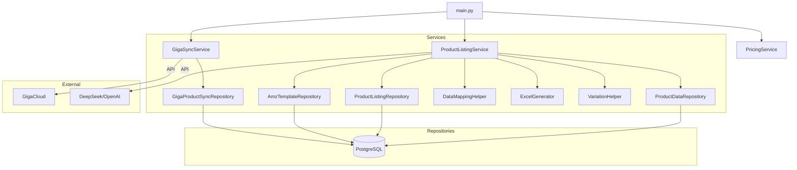

# System Architecture

## 1. Overview

The **Amazon Listing Management System** is a CLI-based application designed to automate the lifecycle of Amazon product listings. It integrates with external suppliers (Giga), manages product data locally, uses AI for content generation, and produces Amazon-ready upload files.

## 2. Architecture Patterns

The system follows a **Layered Architecture** pattern:

1.  **Presentation Layer (CLI)**: `main.py` handles user interaction and argument parsing.
2.  **Service Layer**: Orchestrates business logic (e.g., `ProductListingService`, `GigaSyncService`).
3.  **Repository Layer**: Abstraction for data access (e.g., `ProductDataRepository`).
4.  **Infrastructure Layer**: Database connections and low-level utilities.

### 2.1 Module Dependency Graph

## 3. Core Modules

### 3.1 Services (`src/services/`)

| Service | Responsibility |
| :--- | :--- |
| **ProductListingService** | Core engine for generating Amazon upload files. Coordinates data fetching, mapping, and Excel generation. |
| **GigaSyncService** | Synchronizes product details from GigaCloud API to local DB. |
| **PricingService** | Calculates selling prices based on costs and margin rules. |
| **ProductDetailGenerationService** | Uses LLM to generate titles, bullets, and descriptions. |

### 3.2 Repositories (`src/repositories/`)

| Repository | Responsibility |
| :--- | :--- |
| **ProductDataRepository** | Read-only access to aggregated product data (Base + LLM + Specs). |
| **ProductListingRepository** | Manages listing status and pending queues. |
| **AmzTemplateRepository** | Manages Amazon specific category templates and rules. |

### 3.3 Utilities (`src/utils/`)

| Utility | Responsibility |
| :--- | :--- |
| **DataMappingHelper** | Maps local data fields to Amazon template fields. |
| **ExcelGenerator** | Writes mapped data into `.xlsm` files using `openpyxl`. |
| **VariationHelper** | Logic for identifying and grouping variation families. |

## 4. Data Flow: Listing Generation

1.  **Trigger**: User selects a category (e.g., "CABINET").
2.  **Fetch**: `ProductListingService` retrieves pending SKUs for that category from `ProductListingRepository`.
3.  **Group**: SKUs are grouped into Variation Families by `VariationHelper`.
4.  **Map**: Each SKU's data is mapped to Amazon fields via `DataMappingHelper`. LLM may be used for specific fields.
5.  **Generate**: Mapped data is written to an Excel template via `ExcelGenerator`.
6.  **Log**: Results are saved to `amz_listing_log`.

## 5. Technology Stack

-   **Language**: Python 3.10+
-   **Database**: PostgreSQL
-   **ORM**: SQLAlchemy 2.0
-   **Data Processing**: Pandas
-   **Excel**: OpenPyXL
-   **AI**: OpenAI API compatible (DeepSeek)
