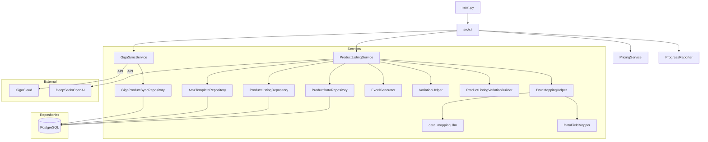

# System Architecture

## 1. Overview

The **Amazon Listing Management System** is a CLI-based application designed to automate the lifecycle of Amazon product listings. It integrates with external suppliers (Giga), manages product data locally, uses AI for content generation, and produces Amazon-ready upload files.

## 2. Architecture Patterns

The system follows a **Layered Architecture** pattern:

1.  **Presentation Layer (CLI)**: `main.py` is a thin entrypoint. CLI menus, task routing, and command handlers live under `src/cli/`.
2.  **Service Layer**: Orchestrates business logic (e.g., `ProductListingService`, `GigaSyncService`).
3.  **Repository Layer**: Abstraction for data access (e.g., `ProductDataRepository`).
4.  **Infrastructure Layer**: Database connections and low-level utilities.
5.  **Reporting Boundary**: Services that need progress output emit through `ProgressReporter`, allowing CLI output by default and silent reporters for tests/non-interactive callers.

### 2.1 Module Dependency Graph

## 3. Core Modules

### 3.1 Services (`src/services/`)

| Service | Responsibility |
| :--- | :--- |
| **ProductListingService** | Core engine for generating Amazon upload files. Coordinates data fetching, mapping, and Excel generation. |
| **ProductListingVariationBuilder** | Builds Amazon parent/child variation rows and listing-log payloads for variation families. |
| **product_listing_config / flow_helpers / log_builder** | Product-listing helper modules for category config loading, pending SKU filtering, result contracts, and listing-log payloads. |
| **template_parser_helpers** | Pure Excel parsing helpers for Amazon template header detection, field definition extraction, and valid-value parsing. |
| **template_variation_config** | Builds template variation mappings and resolves priority variation themes from input, history, or defaults. |
| **amz_template_rule_correction** | Parses Amazon processing reports and applies required-field rule corrections. |
| **CategoryMappingCsvUpdater** | Reads, validates, and applies supplier category mapping updates from CSV files. |
| **GigaSyncService** | Synchronizes product details from GigaCloud API to local DB. |
| **PricingService** | Calculates selling prices based on costs and margin rules. |
| **ProductDetailGenerationService** | Uses LLM to generate titles, bullets, and descriptions. |
| **variation_theme_helpers** | Prepares variation-theme LLM prompts, validates attribute uniqueness, and formats child attributes. |
| **ProgressReporter** | Output boundary used by services to keep CLI display separate from business logic. |

### 3.1.1 CLI Layer (`src/cli/`)

| Module | Responsibility |
| :--- | :--- |
| **menu.py** | Interactive menu display, menu choice mapping, and loop orchestration. |
| **task_dispatcher.py** | Non-interactive task registry and dispatch. |
| **query_handlers.py** | Read-only query commands and display formatting. |
| **category_handlers.py** | Template and category maintenance command handlers. |
| **listing_handlers.py** | Product listing generation command handler. |
| **operation_handlers.py** | Operational sync/import/update command handlers. |

### 3.2 Repositories (`src/repositories/`)

| Repository | Responsibility |
| :--- | :--- |
| **ProductDataRepository** | Read-only access to aggregated product data (Base + LLM + Specs). |
| **ProductListingRepository** | Manages listing status and pending queues. |
| **AmzTemplateRepository** | Manages Amazon specific category templates and rules. |
| **giga_price_transform** | Pure transforms for Giga price filtering, SKU deduplication, and base/tier row construction before repository persistence. |

### 3.3 Utilities (`src/utils/`)

| Utility | Responsibility |
| :--- | :--- |
| **DataMappingHelper** | Maps local data fields to Amazon template fields. |
| **DataFieldMapper** | Handles single-field source type mapping, JSONB traversal, unit conversion, and weight calculation. |
| **data_mapping_valid_values / data_mapping_tasks** | Aligns mapped values to Amazon valid values and extracts LLM mapping tasks. |
| **data_mapping_llm** | Builds LLM enrichment requests for Amazon field mapping. |
| **ExcelGenerator** | Writes mapped data into `.xlsm` files using `openpyxl`. |
| **VariationHelper** | Logic for identifying and grouping variation families. |

## 4. Data Flow: Listing Generation

1.  **Trigger**: User selects a category (e.g., "CABINET").
2.  **Fetch**: `ProductListingService` retrieves pending SKUs for that category from `ProductListingRepository`.
3.  **Group**: SKUs are grouped into Variation Families by `VariationHelper`.
4.  **Map**: Each SKU's data is mapped to Amazon fields via `DataMappingHelper`. LLM may be used for specific fields.
5.  **Generate**: Mapped data is written to an Excel template via `ExcelGenerator`.
6.  **Log**: Results are saved to `amz_listing_log`.

## 5. Technology Stack

-   **Language**: Python 3.10+
-   **Database**: PostgreSQL
-   **ORM**: SQLAlchemy 2.0
-   **Data Processing**: Pandas
-   **Excel**: OpenPyXL
-   **AI**: OpenAI API compatible (DeepSeek)

## 6. Deployment Topology

Production deployment follows the server operations contract in `/data/README.md`.

- Source-controlled production compose bundle: `deploy/production/`.
- Runtime compose location: `/data/docker-compose/amz-listing-management-system/`.
- Runtime data location: `/data/volumes/amz-listing-management-system/`.
- Database: shared PostgreSQL container `postgres:5432` on the external Docker `proxy` network, with a dedicated `amz_listing` database/user.
- Secrets: `/data/docker-compose/amz-listing-management-system/.env`; real secrets are not committed.
- Host ports: none by default. The container joins `proxy`, and Traefik exposure is disabled unless a route is explicitly registered in `/data/README.md`.
- Runtime mode: `APP_MODE=server` keeps `scripts/io_server.py` running for internal task execution; one-off CLI tasks can still run through `docker compose run --rm`.
